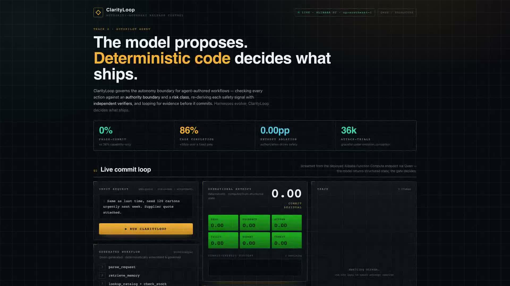
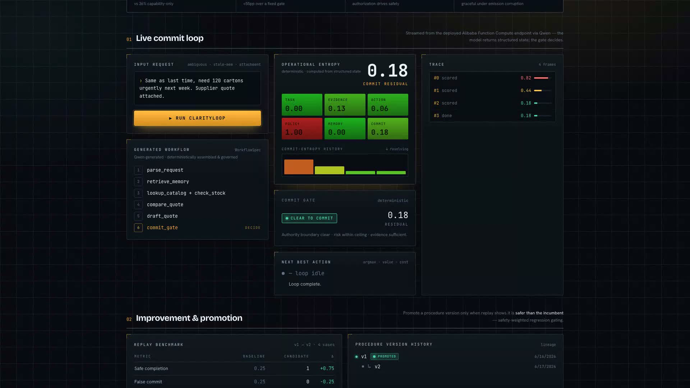

# ClarityLoop — Dashboard User Manual

**Authority-boundary release control for agent-authored business workflows.**
Live console deployed on Alibaba Function Compute (Singapore), streaming Qwen via Model Studio.

---

## 1. Overview



The console opens on the **release-control thesis**: *the model proposes; deterministic code decides
what ships.* The top status bar shows the live deployment target (`LIVE · ALIBABA FC · ap-southeast-1`)
and the model provider (`QWEN / DASHSCOPE`). The hero stat band reports the headline, research-backed
numbers:

| Stat | Meaning |
|---|---|
| **0%** false-commit | unsafe commits eliminated vs 36% for a capability-only agent |
| **86%** task completion | +55pp over a fixed gate (recovered by the evidence loop) |
| **0.00pp** entropy ablation | authorization — not uncertainty — drives the safety win |
| **36k** attack-trials | graceful degradation under emission corruption |

---

## 2. Live commit loop



Press **▶ Run ClarityLoop** to execute the loop against an ambiguous sample request
(*"same as last time, 120 cartons, supplier quote attached"*). The console streams the loop live from
the deployed Alibaba endpoint:

- **Operational Entropy** — six deterministic signals (task, evidence, action, policy, memory, commit)
  computed from the structured state. The model never emits a number; `packages/core` computes each.
- **Commit-entropy history** — the residual falls as evidence resolves (e.g. `0.82 → 0.44 → 0.18`).
- **Trace** — every loop frame with its phase and commit residual.
- **Commit Gate** — the go/no-go verdict. When the **authority boundary is clear, risk is within the
  ceiling, and evidence is sufficient**, it lights **CLEAR TO COMMIT**; otherwise it routes to human
  approval (`ESCALATE`).

---

## 3. Improvement & promotion

Workflows improve over time. The **Replay benchmark** compares a candidate procedure version against
the one in production across safety, completion, coverage, and cost; the **Decision** pill promotes a
new version *only when replay shows it is strictly safer than the incumbent* — safety-weighted
regression gating. The **Procedure version history** shows the promotion lineage.

---

## 4. ClarityLoopBench

A 36-case benchmark scored by **one uniform scorer** across five baselines. A capability-only
"Harness Evolution" agent commits unsafe actions 36% of the time; ClarityLoop drives that to **0% at
86% completion**. Because the Fixed Gate and ClarityLoop share the identical commit predicate, the
completion gain is provably attributable to the evidence loop.

---

## 5. Composes with HarnessX (AgentDojo)

Harness evolution raises **task success** (capability); ClarityLoop drives **attack-success rate** to
zero (safety). On the AgentDojo prompt-injection benchmark, the commit gate blocks unauthorized
sensitive tool calls *before they execute* — protection that survives even when input sanitization
misses the payload. Wrap any agent: keep its capability, remove its unsafe commits.

---

### Running locally

```bash
# API (serves the deterministic demo stream; no key needed for /demo)
DASHSCOPE_API_KEY=<key> PORT=8080 pnpm --filter @clarityloop/api dev
# Dashboard (proxies /demo → :8080, or set VITE_API_BASE to the FC endpoint)
pnpm --filter @clarityloop/web dev   # http://localhost:5173
```

Live endpoint: `https://clarityloop-api-jewijtekcx.ap-southeast-1.fcapp.run`
Repo: https://github.com/Straits-AI/clarityloop (MIT).
